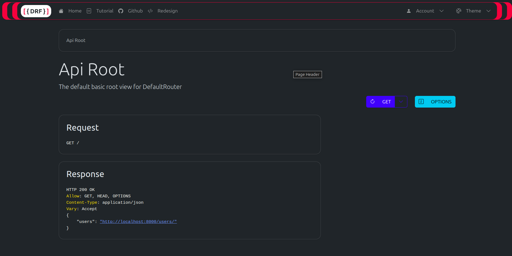
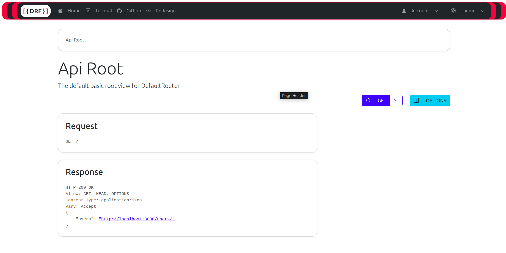

# 🚀 drf-redesign

Source code: https://github.com/youzarsiph/drf-redesign/

## Screenshots


DRF Redesign Dark Mode


DRF Redesign Light Mode

## 🛠️ Get started

To use drf-redesign, follow these simple steps:

Install the package:

```shell
pip install drf-redesign
```

Add `drf_redesign` to `INSTALLED_APPS` setting, before `rest_framework`

```python
# settings.py

INSTALLED_APPS = [
    # ...,
    'drf_redesign',
    'rest_framework',
    ...
]
```

That's it! You're ready to go. 😎

I hope you find this useful. Let me know if you have any feedback or questions. 😊